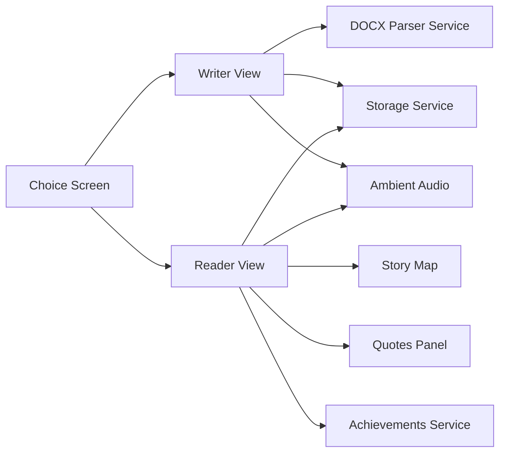

<div align="center">


[](https://github.com/abhinash000/fantic_writer)


</div>

## Overview

Fantic Writer is an immersive storytelling studio that combines:

- A structured manuscript editor for chapter creation
- A cinematic reader for focused consumption
- A visual story map for narrative navigation
- A quote collection system for memorable fragments

It is designed to make writing and reading feel intentional, atmospheric, and fluid.

## Table of Contents

- [Overview](#overview)
- [Feature Set](#feature-set)
- [Live Interface Preview](#live-interface-preview)
- [Architecture at a Glance](#architecture-at-a-glance)
- [Getting Started](#getting-started)
- [Project Structure](#project-structure)
- [Product Direction](#product-direction)

## Feature Set

| Capability | Details |
| --- | --- |
| Mode Selection | Dedicated entry screen to choose Writer or Reader flow |
| Writer Workspace | Chapter CRUD, emotion tagging, manuscript organization |
| Special Chapters | Built-in templates: Title, Dedication, Epigraph, Prologue |
| DOCX Import | Word document parsing with automatic chapter splitting |
| Reader Experience | Immersive reading layout with chapter progress tracking |
| Story Map | Visual chapter navigation and jump controls |
| Collected Fragments | Save selected quotes, revisit, jump back, and remove |
| Focus Utilities | Zen mode, fullscreen mode, low-distraction reading/writing |
| Search | In-view search in both writer and reader interfaces |
| Atmosphere Controls | Ambient music mode tied to chapter emotion |
| Progress Rewards | Achievement unlocks for reading and quote milestones |
| Persistence | Local save for novel, settings, view mode, quotes, achievements |
| Personalization | Theme controls, font size, and line-height settings |

## Live Interface Preview

<p align="center">
	
</p>

<p align="center"><strong>Reader View</strong> · Cinematic typography, chapter flow, focused immersion</p>

<p align="center">
	
</p>

<p align="center"><strong>Story Map</strong> · Visual chapter progression and universe navigation</p>

<p align="center">
	
</p>

<p align="center"><strong>Writer Workspace</strong> · Chapter management, drafting, and structural control</p>

## Architecture at a Glance



## Getting Started

### Prerequisites

- Node.js (LTS recommended)

### Install

```bash
npm install
```

### Environment

Create/update `.env.local`:

```env
GEMINI_API_KEY=your_key_here
```

### Run Dev Server

```bash
npm run dev
```

### Production Build

```bash
npm run build
```

## Project Structure

```text
components/   UI screens (Choice, Writer, Reader, Story Map, Quotes)
services/     app logic (storage, achievements, DOCX parsing, API)
images/       screenshots and visual assets
scripts/      utility scripts
```

## Product Direction

Fantic Writer aims to blend narrative tooling with cinematic design language.
The goal is simple: make each chapter feel authored like a manuscript and experienced like a scene.
