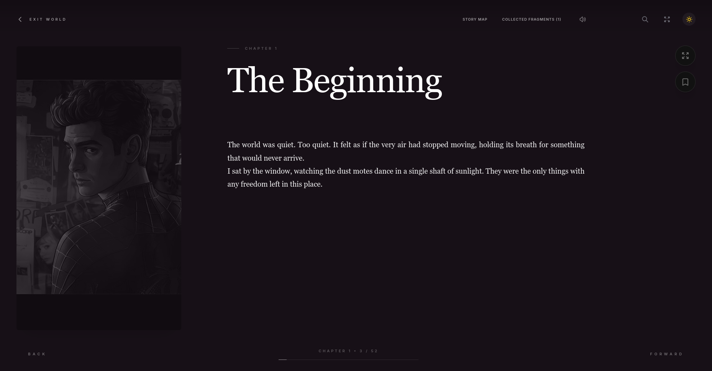
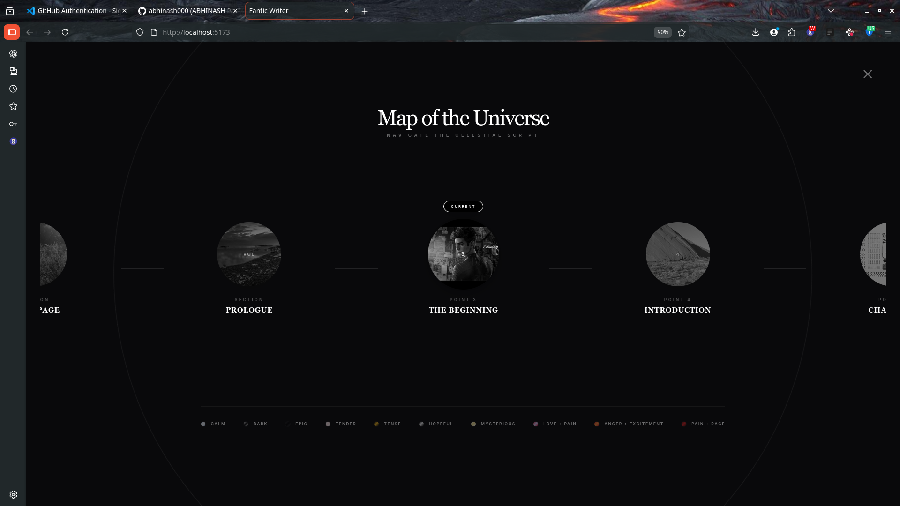
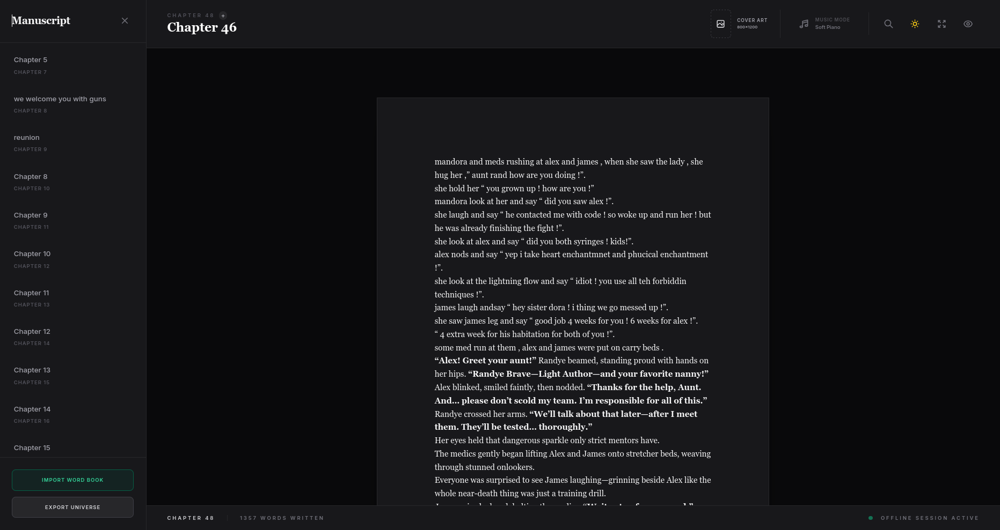

# Fantic Writer

> A cinematic writing and reading workspace for building story chapters, navigating a visual story map, and exploring immersive prose in a focused interface.

## Why This Project Exists

Fantic Writer is designed for authors who want structure and atmosphere at the same time.
Instead of a plain editor, it combines a manuscript workspace, a map-like chapter navigator,
and a distraction-light reading experience.

## Experience Highlights

- Chapter-based writing workflow
- Visual story map navigation
- Reader mode with immersive layout
- Cover-art aware storytelling UI
- Local-first development with Vite + React + TypeScript

## Demo Gallery

### Reader View



### Story Map



### Writer Workspace



## Tech Stack

- React
- TypeScript
- Vite

## Local Setup

Prerequisite: Node.js (LTS recommended)

1. Install dependencies:

```bash
npm install
```

2. Add your API key to `.env.local`:

```env
GEMINI_API_KEY=your_key_here
```

3. Start development server:

```bash
npm run dev
```

4. Build for production:

```bash
npm run build
```

## Project Structure

```text
components/   UI screens and story interfaces
services/     storage, parsing, API, achievements
images/       demo and UI assets
scripts/      utility conversion scripts
```

## Vision

Write stories that feel like worlds. Navigate them like constellations.
